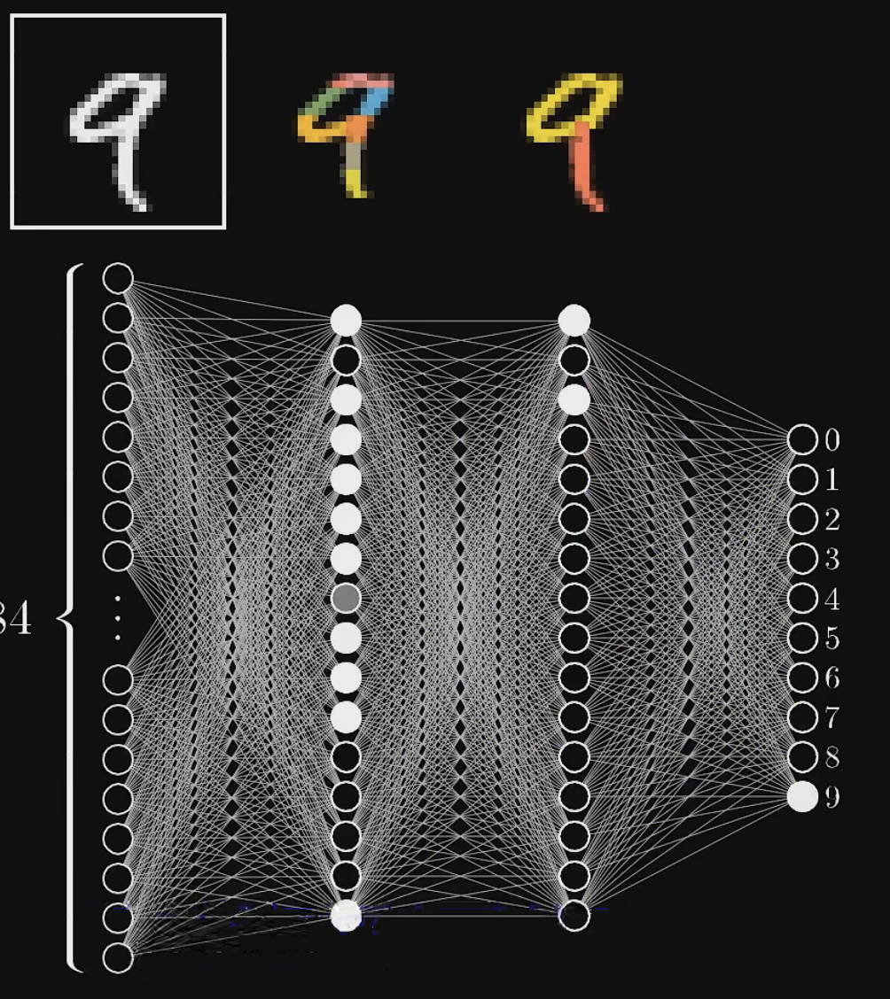
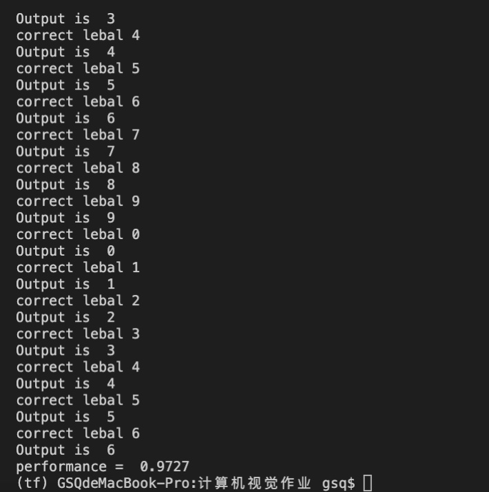

# 计算机视觉第一次大作业

#### 【题目】：使用Python实现手写数字识别模型

#### 【使用数据集】：MNIST数据集，下载地址http://yann.lecun.com/exdb/mnist/ 

「任务」实现一个用于MNIST数字识别的三层神经网络程序（输入层，隐藏层，输出层）

​        

​    除了校内的教学资料，我还参考了：

>  [【官方双语】深度学习之神经网络的结构 Part 1 ver 2.0_哔哩哔哩bilibili](https://www.bilibili.com/video/BV1bx411M7Zx/?spm_id_from=333.788.video.desc.click)

> [BebDong/NumRecognition: 利用神经网络识别手写数字，MNIST数据集测试 (github.com)](https://github.com/BebDong/NumRecognition)

> [【神经网络】三分钟带你看懂神经网络前向传播过程哔哩哔哩bilibili](https://www.bilibili.com/video/BV11g411u7eL?from=search&seid=10365492907249168439&spm_id_from=333.337.0.0)

简单的原理示意图：

#### 最后结果图：(使用的是sigmoid激活函数)

#### 可以使用 ReLU 函数进行性能提升改进
